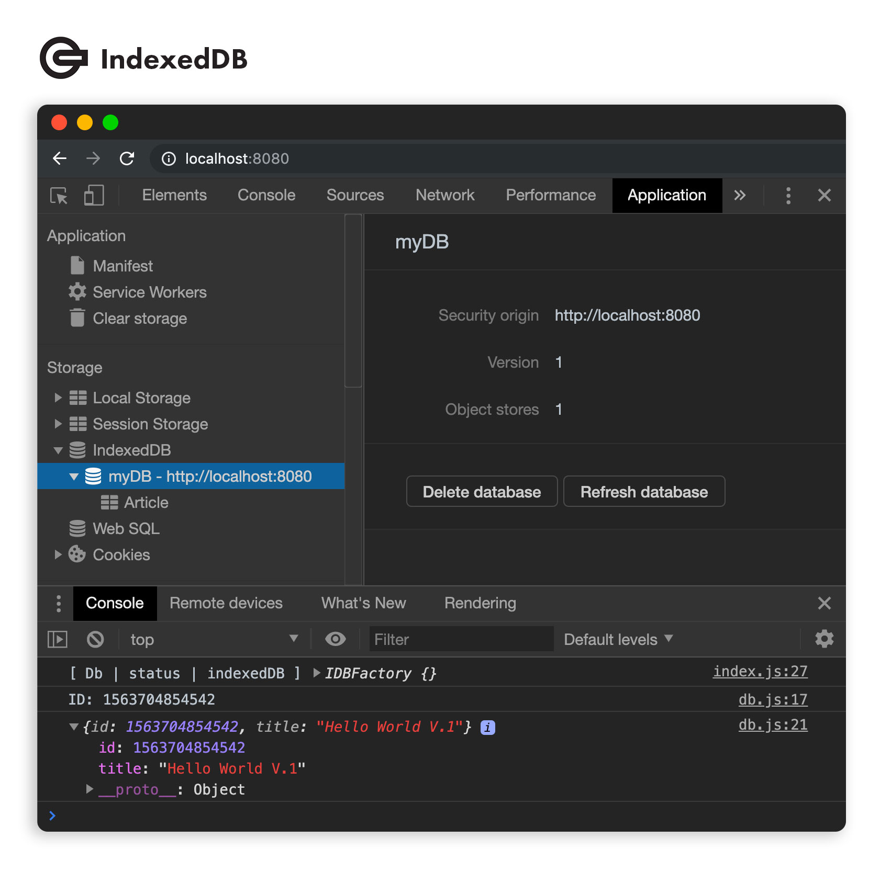

# Micro IndexedDB [](https://github.com/RichardLitt/standard-readme)

💾 Micro library JavaScript for implementation local DB IndexedDB that is durable and scalable. Include this library into your native JavaScript application with embed script type module or your React, Angular and others frameworks with npm module.



## Native and NPM Installation

### Native JavaScript

Copy "index.js" file into the main folder of your JavaScript application and import it with a simple script reference into other js file, for example "db.js".

```js
import Db from "./index.js";
```

### NPM

```bash
npm i micro-indexeddb
```

```js
import Db from "micro-indexeddb";
```

## Run

```js
// Define and init Database
Db.init("myDB", 1, [{
  name: "Article",
  details: {
    keyPath: "id"
  }
}]);

// Save data into Database
const id = await Db.add("Article", {
  "id": Date.now(),
  "title": "Hello World V.1"
});

// Get all data from registered
const result = await Db.findById("Article", id);

// Update data with keypath
await Db.put("Article", {
  "id": id,
  "title": "Hello World V.2"
});

// Remove data with keypath
await Db.delete("Article", id);
```

## Example
You can see an example 
[HERE](example/README.md)

## Maintainers
 \
[@JoseJPR](https://github.com/JoseJPR)

## Contact
🎓 Linkedin: https://www.linkedin.com/in/josejpr/ \
🐦 Twitter: https://twitter.com/JoseJ_PR \
📧 Send email to: me@josejpr.com

## License
[MIT](LICENSE.md)

## Happy Code
Created with JavaScript, lot of ❤️ and a few 🍺

#### This README.md file has been written keeping in mind:
- [GitHub Markdown](https://guides.github.com/features/mastering-markdown/)
- [Emoji Cheat Sheet](https://www.webfx.com/tools/emoji-cheat-sheet/)