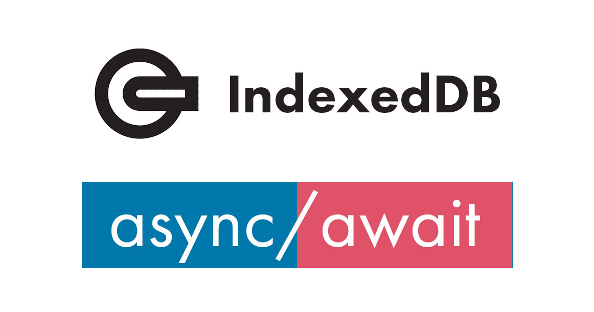
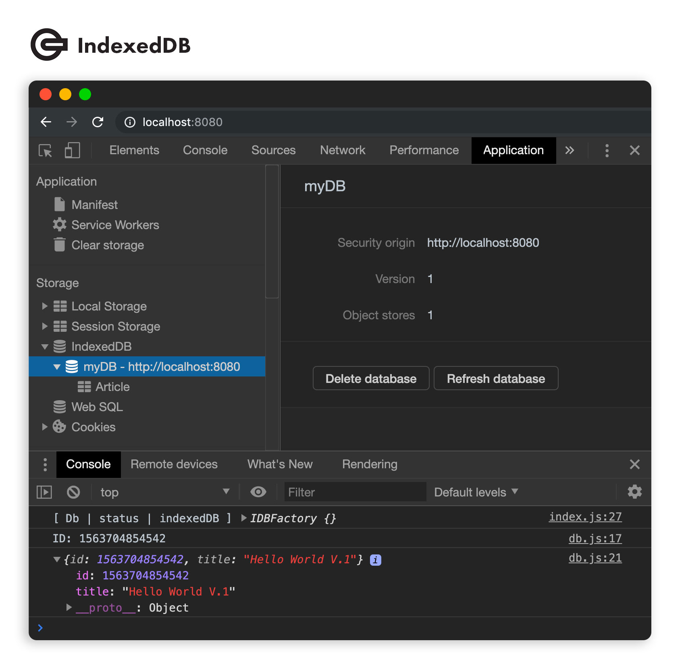

<p align="center">
  
</p>

<h1 align="center">Micro IndexedDB</h1>

<p align="center">
  <a title="MIT License" href="LICENSE.md">
    
  </a>
  <a title="Twitter: JoseJ_PR" href="https://twitter.com/JoseJ_PR">
    
  </a>  
  <a title="Github: Sponsors" href="https://github.com/sponsors/JoseJPR">
    
  </a>
  <br />
  <br />
</p>

<p align="center">
  
</p>

## 🔖 Description

💎 Micro JavaScript Library for implementation local 💾 Database IndexedDB that is durable and scalable. Include this library into your native JavaScript application with embed script type module or your React, Angular and others frameworks with npm module.

## 📐 How to work with this project

### Native JavaScript

Copy "index.js" file into the main folder of your JavaScript application and import it with a simple script reference into other js file, for example "db.js".

```js
import Db from "./index.js";
```

### NPM

```bash
npm i micro-indexeddb
```

```js
import Db from "micro-indexeddb";
```

## Run

```js
// Define and init Database
Db.init("myDB", 1, [{
  name: "Article",
  details: {
    keyPath: "id"
  }
}]);

// Save data into Database
const id = await Db.add("Article", {
  "id": Date.now(),
  "title": "Hello World V.1"
});

// Get all data from registered
const result = await Db.findById("Article", id);

// Update data with keypath
await Db.put("Article", {
  "id": id,
  "title": "Hello World V.2"
});

// Remove data with keypath
await Db.delete("Article", id);
```

## 📂 Code Scaffolding

```any
/
├── assets 🌈                   # Images Sources.
├── src 📦                      # Main file library.
|   └── ...
└── ...
```

## ⛽️ Review and Update Sependencies

For review and update all npm dependencies of this project you need install in global npm package "npm-check-updates" npm module.

```bash
# Install and Run
$npm i -g npm-check-updates
$ncu
```

## License

[MIT](LICENSE.md)

## Happy Code

Created with JavaScript, lot of ❤️ and a few ☕️

## This README.md file has been written keeping in mind

[GitHub Markdown](https://guides.github.com/features/mastering-markdown/) \
[Emoji Cheat Sheet](https://www.webfx.com/tools/emoji-cheat-sheet/)
